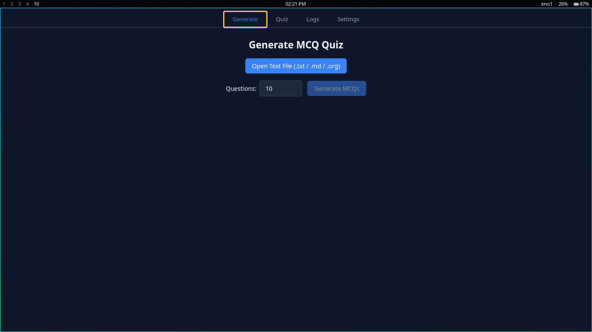
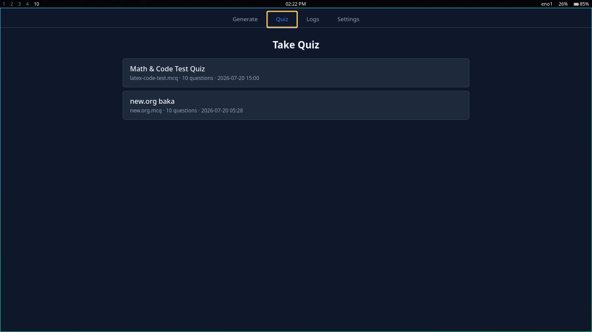
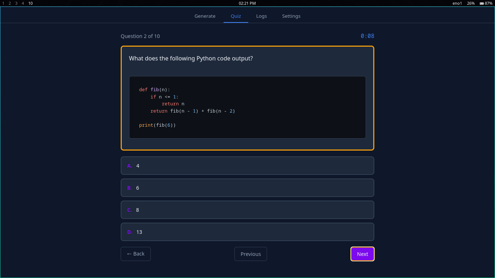
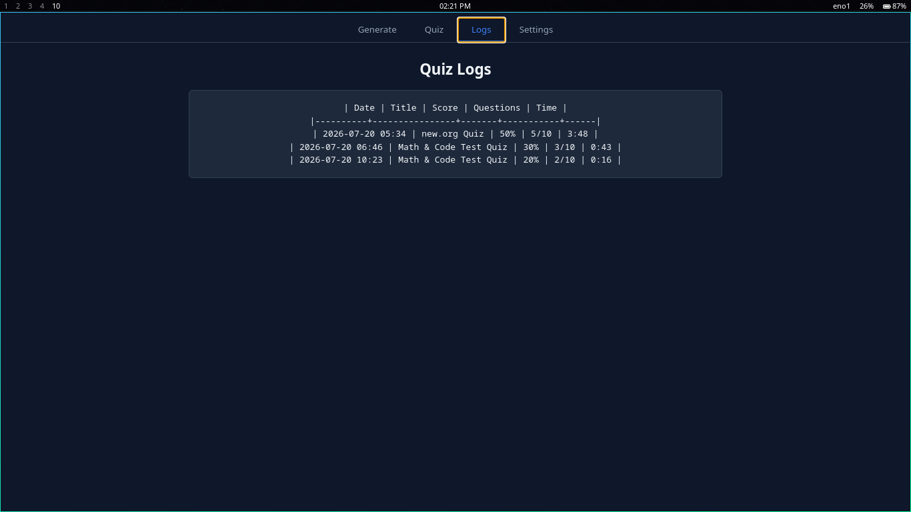
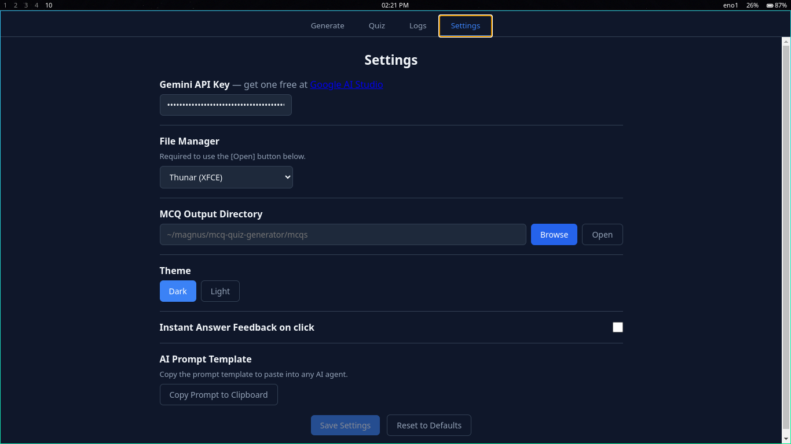

#+DESCRIPTION: MCQ Quiz Generator - Create and take MCQ quizzes from text files

* MCQ Quiz Generator

Desktop app for generating and taking multiple-choice quizzes from
plain text, Markdown, or Org files.  Uses Google Gemini (free tier)
to auto-generate questions, or you can write =.mcq= files by hand.

Inspired by the MCQ feature in
[[https://github.com/megamind1230/nextlearn][megamind1230/nextlearn]].
This project ports the core concept (AI generation, =.mcq= file format,
  interactive quiz) to an Electron + React stack.

* Screenshots

  
  Generate tab -- pick a source file and generate MCQs with Gemini.

  
  Quiz tab -- browse and start saved .mcq quizzes.

  
  Interactive quiz -- one question at a time with rich text, timer, keyboard shortcuts.

  
  Logs tab -- quiz history with scores and timing.

  
  Settings -- API key, output directory, theme, feedback, shuffle, encrypt toggles.

* Features

** Generation
  - Generate MCQ quizzes from =.txt=, =.md=, =.org= source files
  - AI-powered via Google Gemini API (free tier, no billing required)
  - Model auto-discovery fallback (tries multiple Gemini models)
  - Choose *single-answer* or *multi-answer* generation (multi uses
    =Select all that apply= format with one or more correct options)
  - Preview first 3 questions before saving
  - Token estimation with safe truncation for large files
  - Copy-paste-ready *single-* and *multi-answer* prompt templates in Settings
    for manual AI use
  - Optional encrypted output (toggle in Settings): saves as =.emcq= with an
    app-embedded key so students can't read answers in a text editor. The app
    opens both =.mcq= and =.emcq= seamlessly; no plaintext temp files are written.
    (Obfuscation against casual reading, not unbreakable security)
  - Bulk encrypt: encrypt all =.mcq= files in the output directory that lack
    a matching =.emcq= (Bulk Encrypt button in Generate tab)

** Quiz
  - One question at a time with clickable option cards
    - *Single answer:* radio-style markers (=●=/=○=), "Single answer" tag
    - *Multi answer:* checkbox-style markers (=☑=/=☐=), "Select all that apply"
      tag and a hint; graded by exact match (all-or-nothing)
  - *Three quiz modes:* after selecting a quiz, choose:
    - *Loop Mode:* instant feedback, retakes wrong answers in batches of 15
      until all mastered, answers locked after selection, no results page
    - *Instant Mode:* instant feedback on every answer, answers locked
      after selection, no results page
    - *Classic Mode:* no instant feedback during quiz, answers editable,
      results summary at the end with export options
  - Count-up timer
  - Explanation display after each answer (in Loop and Instant modes)
  - Next/Previous navigation
  - =← Leave= button to quit to quiz list (with confirmation)
  - Esc / q to quit from anywhere
  - Export results (PDF / HTML / Org / MD / TXT) from the results page (Classic mode)
    - PDF generated by printing a self-contained HTML version (math & code render)
    - HTML is fully self-contained (KaTeX fonts embedded)

** Rich Content
  - LaTeX math rendering (KaTeX) -- inline =\$...\$= and display =\$\$...\$\$=
  - Code syntax highlighting (highlight.js) -- fenced blocks + inline =`=code`=`
  - Click-to-copy:
    - *Code blocks / display math:* hover to reveal a *Copy* button (top-right)
    - *Inline code / inline math:* click the element directly to copy
    - *Feedback:* button text swaps to "Copied!" for 1s, inline gets a green flash

** Results
  - Percentage score with color coding (green/orange/red)
  - Per-question review: correct, wrong, or skipped
  - Full rich text rendering in explanations (LaTeX, code)
  - Results logged to localStorage for history

** Keyboard Shortcuts
  | Key         | Action                        |
  |-------------+-------------------------------|
  | =a= =b= =c= =d= | Select answer                 |
  | =n= / =→=         | Next question                 |
  | =p= / =←=         | Previous question             |
  | =j= / =k=         | Scroll down / up              |
  | =h= / =l=         | Scroll left / right           |
  | =Esc= / =q=       | Quit to quiz list (saves nothing) |

** General
  - Dark / light theme toggle
  - Configurable MCQ output directory
  - File manager selector (26 Linux file managers supported)
  - Quiz history table (date, title, score, questions, time)
  - Frameless window with custom title bar
  - Remembers last opened file picker directory

* Prerequisites
  - Node.js 18+ and npm
  - Linux (tested), macOS, or Windows
  - Google Gemini API key (free) -- get one at [[https://aistudio.google.com/apikey][AI Studio]]

* Quick Start

  #+BEGIN_SRC bash
  git clone <repo-url> && cd mcq-quiz-generator
  npm install
  npm run dev
  #+END_SRC

  1. Go to *Settings* tab, paste your Gemini API key
  2. Go to *Generate* tab, open a .txt / .md / .org file
  3. Set question count, click *Generate MCQs*
  4. Preview, then *Save .mcq File*
  5. Go to *Quiz* tab, click the saved quiz to start
  6. Choose *Loop Mode*, *Instant Mode*, or *Classic Mode* in the mode picker

* Available Scripts

  | Command               | Description                          |
  |-----------------------+--------------------------------------|
  | =npm run dev=         | Start in development mode            |
  | =npm run build=       | Build for production                 |
  | =npm run preview=     | Preview production build             |
  | =npm test=            | Run unit tests (vitest)              |
  | =npm run test:watch=  | Run tests in watch mode              |
  | =npm run typecheck=   | Type-check both node and web code    |
  | =npm run lint=        | Lint renderer source with ESLint     |

* Project Structure

  #+BEGIN_SRC
  mcq-quiz-generator/
  ├── src/
  │   ├── main/              # Electron main process
  │   │   └── index.ts       # Window, IPC handlers, file ops
  │   ├── preload/           # Context bridge (main <-> renderer)
  │   │   └── index.ts
  │   └── renderer/          # React frontend
  │       └── src/
  │           ├── App.tsx              # Root component, tab nav
  │           ├── SettingsContext.tsx   # Settings React context
  │           ├── types.ts             # Shared TypeScript types
  │           ├── styles.css           # All CSS
  │           ├── components/
  │           │   ├── GeneratePanel.tsx # AI generation UI
  │           │   ├── QuizView.tsx      # Quiz + results UI
  │           │   ├── QuizLogs.tsx      # Quiz history table
  │           │   └── Settings.tsx      # Settings page
  │           ├── utils/
  │           │   ├── mcqParser.ts      # .mcq -> McqDocument
  │           │   ├── mcqWriter.ts      # McqDocument -> .mcq
  │           │   ├── mcqGenerator.ts   # Gemini API calls + prompt templates
  │           │   ├── quizModes.ts      # Quiz modes + grading + isInstantMode
  │           │   ├── quizExporter.ts   # Export to PDF/HTML/Org/MD/TXT
  │           │   ├── format.ts         # Shared formatTime + escapeHtml
  │           │   ├── constants.ts      # ANSWER_LABELS + ANSWER_KEYS
  │           │   ├── shuffle.ts        # Fisher-Yates shuffle
  │           │   ├── inputParser.ts    # .txt/.md/.org -> plain text
  │           │   ├── renderRichText.ts # KaTeX + highlight.js
  │           │   ├── settings.ts       # Load/save settings
  │           │   └── quizLogger.ts     # localStorage results
  │           └── __tests__/            # Unit tests (vitest)
  ├── out/                   # Built output (gitignored)
  ├── plans-and-todos.org     # Implementation plan
  ├── bugs.org               # Known bugs and fixes
  ├── changelog.org          # Version history
  └── README.org
  #+END_SRC

  This repository is the *desktop* app.  A companion *mobile* student PWA
  (offline quiz taker that opens =.mcq=/=.emcq= files) lives in the sibling
  project =mcq-quiz-generator-mobile=.

* How It Works

  1. *Input:* User picks a .txt/.md/.org file
  2. *Strip:* =inputParser= removes markup, returns plain text
  3. *Generate:* Plain text is sent to Gemini API with a structured prompt
  4. *Parse:* AI response is parsed into =McqDocument= (questions + options + answers)
  5. *Save:* Serialized to =.mcq= format (YAML frontmatter + markdown questions)
  6. *Quiz:* =mcqParser= reads =.mcq= files, =QuizView= renders questions
     - User chooses a mode: *Loop* (retake wrong answers), *Instant* (instant feedback), or *Classic* (deferred feedback)
     - Loop and Instant modes lock answers after selection (anti-cheat)
  7. *Results:* Score + per-question review (Classic mode), logged to localStorage

* Gemini Prompt

  There are two prompt templates (also available as copy-paste buttons in
  Settings): one for *single-answer* questions and one for *multi-answer*
  questions.  You can use them with any AI agent to generate =.mcq= files
  manually.

  *Single-answer* variant:

  #+BEGIN_SRC
  You are an educator creating multiple-choice questions from study material.
  Given the deck content below, create {questionCount} questions.

  Format each question EXACTLY like this:

  ## Question N
  {question text}

  A. {option A}
  B. {option B}
  C. {option C}
  D. {option D}

  **[Answer: A]**
  **Explanation:** {why this is correct}

  ---

  Rules:
  - Each question must have exactly 4 options (A, B, C, D)
  - Make sure exactly one answer is correct
  - Distractors should be plausible but clearly wrong
  - Use --- on its own line as a separator between questions
  - Do NOT use any markdown code fences
  - Cover EVERY section of the content -- do not skip any part
  - Generate exactly {questionCount} questions
  - Do NOT translate or modify these exact keywords: ## Question, **[Answer: ...]**, **Explanation:**, A., B., C., D.  The app parser depends on them.
  #+END_SRC

  *Multi-answer* variant is identical except it uses the =**[Answer:A,C]=**
  bracket syntax (comma-separated letters, no space after the colon) and asks
  for at least two correct options so some questions can have multiple answers:


* MCQ File Format (.mcq)

  =.mcq= files are regular Markdown with a strict structure.  You can
  write them by hand or generate them with the app.  The parser is
  deterministic -- no guessing, no tolerance for deviations.

** Frontmatter (required)

  Must start with YAML frontmatter delimited by =---=.

  | Field       | Purpose                         | Example              |
  |-------------+---------------------------------+----------------------|
  | =title=     | Display name shown in quiz list | =Algebra Quiz=       |
  | =source=    | Original source filename        | =algebra.md=         |
  | =generated= | Timestamp of creation           | =2026-07-18 14:30=   |

** Question blocks (strict order)

  After frontmatter, each question follows this *exact* sequence:

  1. =## Question N= heading (N = 1, 2, 3, ...)
  2. Question text (one or more lines)
  3. Four options: =A.=, =B.=, =C.=, =D.= (each on its own line)
  4. The answer line =**[Answer: X]=** or =**[Answer:X,Y]=** (see below)
  5. =**Explanation:**= followed by explanation text (optional)
  6. =---= separator before the next question

   The answer line comes in two forms:

   - *Single answer* (one correct option): =**[Answer: B]=**
   - *Multi answer* (two or more correct options, =Select all that apply=):
     =**[Answer:A,C]=** (comma-separated letters, *no space* after the colon)

   A question is treated as multi-answer whenever the answer line has more
   than one letter.  Multi-answer questions are graded as all-or-nothing
   (exact match).

** Example

  #+BEGIN_SRC markdown
  ---
  title: Physics Quiz
  source: physics.md
  generated: 2026-08-01 10:00
  ---

  ## Question 1
  What is the integral of $f(x) = 3x^2$ from 0 to 1?

  A. 0
  B. 1
  C. 2
  D. 3

  **[Answer: B]**
  **Explanation:** $\int_0^1 3x^2\,dx = \left[x^3\right]_0^1 = 1$.

  ---

  ## Question 2
  What does this Python function return?

  ```python
  def fib(n):
      if n <= 1:
          return n
      return fib(n - 1) + fib(n - 2)
  ```

  A. The sum of 1 to n
  B. The nth Fibonacci number
  C. The factorial of n
  D. The nth prime number

  **[Answer: B]**
  **Explanation:** `fib(n)` recursively computes Fibonacci numbers: `fib(0)=0, fib(1)=1, fib(n)=fib(n-1)+fib(n-2)`.

  ---

  ## Question 3
  Which of the following are prime numbers?

  A. 7
  B. 9
  C. 13
  D. 15

  **[Answer:A,C]**
  **Explanation:** 7 and 13 are prime. 9 = 3x3 and 15 = 3x5 are composite.
  #+END_SRC

** Rich text in questions

  Questions and explanations support LaTeX and code:

  - Inline math: =$x^2 + y^2 = z^2$=
  - Display math: =$$\int_0^1 f(x)\,dx$$=
  - Fenced code: =```python\ncode\n```=
  - Inline code: =`=code`=`

* Settings

  Accessible from the Settings tab:

  | Setting                | Description                                          |
  |------------------------+------------------------------------------------------|
  | Gemini API Key         | Required for AI generation. Free at AI Studio.       |
  | MCQ Output Dir         | Where =.mcq= files are saved. Default: =~/magnus/mcq-quiz-generator/mcqs= |
  | File Manager           | File manager to open directories (26 options)        |
  | Theme                  | Dark / light mode                                    |
  | Randomize Options      | Shuffle answer order per question                    |
  | Randomize Q Order      | Shuffle question order each quiz                     |
  | Encrypt Output         | Save =.emcq= alongside =.mcq= (obfuscation)         |

* Logs

  App logs: =~/magnus/mcq-quiz-generator/logs/YYYY-MM-DD.log=
  Quiz results: localStorage (browser local storage, per-machine)

* Tech Stack

  | Layer          | Tech                    | Version  |
  |----------------+-------------------------+----------|
  | Desktop shell  | Electron                | ^33      |
  | UI framework   | React + TypeScript      | ^19      |
  | Build tooling  | electron-vite + Vite    | ^2 / ^5  |
  | Math rendering | KaTeX                   | ^0.18    |
  | Code highlight | highlight.js            | ^11      |
  | AI backend     | Gemini API (REST)       | free     |
  | Unit tests     | vitest                  | ^4       |

* Contributing

  #+BEGIN_SRC bash
  npm run dev          # start dev server
  npm test             # run tests
  npm run typecheck    # type-check
  npm run lint         # lint
  #+END_SRC

  - Keep =bugs.org=, =changelog.org=, =plans-and-todos.org= in sync
  - Run =npm test= before committing
  - Follow existing code style (no new dependencies without good reason)
